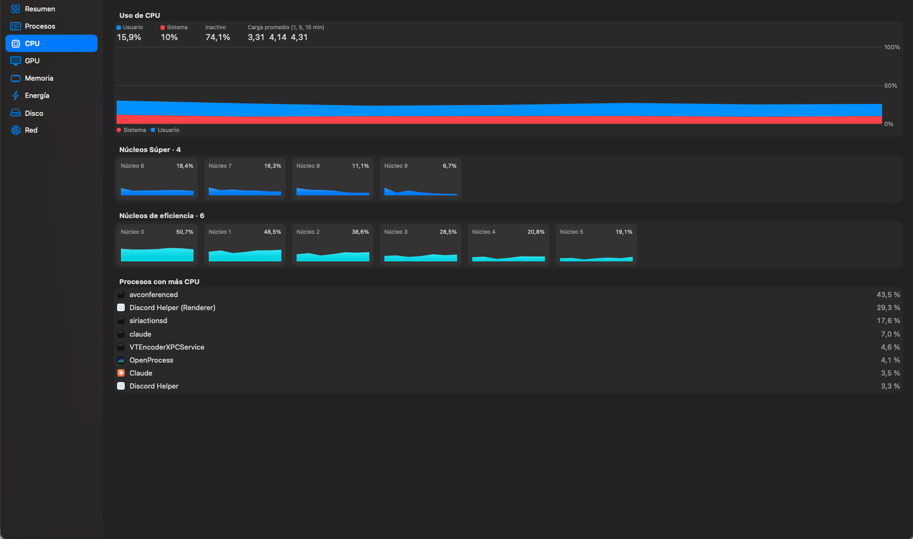
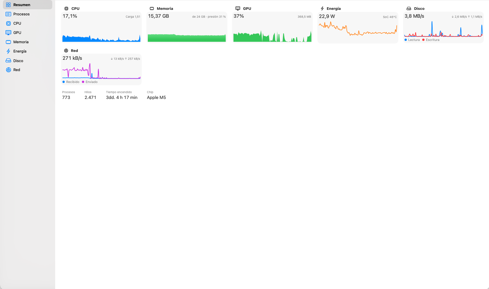

<div align="center">


# OpenProcess

**Todo lo que hace tu Mac, en tiempo real.**

Un reemplazo nativo y de código abierto del Monitor de Actividad para macOS.

[](LICENSE)


</div>

---

## 📖 Descripción

OpenProcess muestra en tiempo real todo lo que ocurre en tu Mac: los procesos del sistema y del usuario, el uso de CPU **núcleo por núcleo**, la GPU, la memoria y su presión, el consumo en vatios, las temperaturas, el disco y la red. Además permite actuar sobre los procesos: terminarlos, forzar su salida, enviarles señales, inspeccionarlos y muestrearlos.

Nació porque el Monitor de Actividad se queda corto para quien lo abre a diario. No muestra la carga de cada núcleo agrupada por cluster (rendimiento / eficiencia), ni la GPU por proceso, ni el consumo real en vatios de cada proceso, ni las temperaturas. OpenProcess agrega todo eso sin dejar de verse y comportarse como una app de Apple: barra de menús completa, atajos de teclado, inspector, modo claro y oscuro, y confirmación antes de cada acción destructiva.

Está escrita en **SwiftUI** con un `NSOutlineView` nativo para la lista de procesos. La tabla de SwiftUI gastaba más del 10 % de CPU reordenando ~750 filas; la tabla nativa mantiene el consumo de la propia app en torno a un 6 % con la ventana abierta y ~2 % con solo el ícono de la barra de menús, actualizando cada 2 segundos. Se distribuye **fuera del App Store** como un DMG firmado con Developer ID y notarizado, porque una app sandboxeada no puede ver ni gestionar los procesos de otros usuarios.

<p align="center">
  
</p>

---

## ✨ Funcionalidades

- **Procesos** — Lista completa (~750 en un Mac típico) en vista plana o **árbol jerárquico**. Búsqueda por nombre, PID, usuario o ruta y filtros: todos, míos, del sistema, de otros usuarios y apps con ventanas. Las columnas se pueden mostrar u ocultar y ordenar desde el encabezado o desde el menú *Visualización*:
  - % de CPU y tiempo de CPU;
  - qué parte corrió en núcleos de rendimiento;
  - hilos, memoria y % de GPU;
  - energía en vatios y activaciones;
  - lectura y escritura de disco;
  - red recibida y enviada.
- **Inspector** (⌘I) — Gráfico de actividad del proceso, ruta, argumentos, proceso padre, archivos y puertos abiertos (`lsof`), y muestreo de 3 s con `sample`, con opción de guardar el reporte.
- **Acciones sobre procesos** — Salir (⌥⌘Q), forzar salida y enviar cualquier señal: `SIGINT`, `SIGHUP`, `SIGTERM`, `SIGQUIT`, `SIGSTOP`, `SIGCONT`, `SIGUSR1`, `SIGUSR2` y `SIGKILL`. Todas piden confirmación, como en el Monitor de Actividad.
- **CPU** — Uso de usuario y sistema, carga promedio y una cuadrícula con cada núcleo agrupado por cluster (por ejemplo, en un M5: 4 núcleos Súper y 6 de eficiencia).
- **GPU** — Utilización del dispositivo, del renderizador y del tiler, memoria en uso y ranking por proceso.
- **Memoria** — Presión (Normal / Advertencia / Crítica, con ícono y texto, no solo color) y desglose en apps, residente, comprimida, caché, purgable, libre y swap. Botón *Purgar memoria*.
- **Energía** — Consumo total del sistema (SMC), GPU en vatios (IOReport), CPU estimada a partir de cada proceso, temperatura del SoC, todos los sensores térmicos y estado de la batería (carga, ciclos, capacidad máxima).
- **Disco y red** — Tasas en vivo, totales desde el arranque y los procesos que más leen, escriben, descargan o suben.
- **Barra de menús** — Un glifo de 5 barras que refleja la carga de los núcleos en vivo, junto al % de CPU. Al abrirlo muestra un panel compacto con CPU, GPU, memoria, presión, red, energía, barras por núcleo y los procesos que más consumen. La app sigue midiendo aunque cierres la ventana.
- **Asistente privilegiado (opcional)** — Un helper del sistema, instalado con `SMAppService`, que permite ver las métricas de los procesos de root y de otros usuarios, terminarlos y purgar la memoria. La app y el helper solo aceptan hablar entre sí si ambos están firmados por el mismo equipo.

<p align="center">
  
</p>

---

## 🛠 Tecnologías

| Capa | Tecnología |
|------|-----------|
| Interfaz | SwiftUI, Swift Charts y `NSOutlineView` de AppKit para la tabla de procesos |
| Lenguaje | Swift 6 (concurrencia estricta) |
| Métricas | `libproc` / `proc_pid_rusage`, `sysctl`, Mach (`host_processor_info`, `host_statistics64`), IOKit, IOReport, SMC, `IOHIDEventSystemClient`, `nettop` |
| Asistente | Launch daemon con `SMAppService` y XPC (`NSXPCConnection`) |
| Proyecto | [XcodeGen](https://github.com/yonaskolb/XcodeGen) (`project.yml`); el `.xcodeproj` no se versiona |
| Firma y distribución | [fastlane](https://fastlane.tools) + match, Developer ID, notarización, DMG con [dmgbuild](https://github.com/dmgbuild/dmgbuild) |
| CI | GitHub Actions (`.github/workflows/release.yml`) |

---

## 📥 Instalación

1. Descarga el último `OpenProcess-<versión>.dmg` desde [Releases](https://github.com/Im-Fran/openprocess/releases).
2. Ábrelo y arrastra **OpenProcess** a la carpeta **Aplicaciones**.
3. *(Opcional)* Para ver y gestionar procesos de otros usuarios, abre **OpenProcess ▸ Ajustes…**, pulsa **Instalar asistente…** y apruébalo en **Ajustes del Sistema ▸ General ▸ Ítems de inicio**.

> Sin el asistente, OpenProcess lista **todos** los procesos, pero las métricas de los que pertenecen a root u otros usuarios aparecen como «—».

**Privacidad:** OpenProcess no envía nada a internet. Toda la información se lee localmente del sistema.

---

## 📋 Requisitos para compilar

- **macOS 26** o superior, en un Mac con Apple Silicon
- **Xcode 26** o superior (el ícono es un archivo de Icon Composer, `.icon`)
- **XcodeGen** — `brew install xcodegen`
- **Ruby 4** y **Bundler** para fastlane (el `Gemfile.lock` usa el formato de Bundler 4)
- **uv** para generar el DMG — `brew install uv`
- Para firmar y notarizar: un certificado **Developer ID Application** y una **API key de App Store Connect**

---

## 🚀 Primeros pasos

### 1. Clona el repositorio

```bash
git clone https://github.com/Im-Fran/openprocess.git
cd openprocess
```

### 2. Genera el proyecto de Xcode

```bash
xcodegen generate
open OpenProcess.xcodeproj
```

El proyecto se regenera desde `project.yml`. Si agregas o eliminas archivos, vuelve a ejecutar `xcodegen generate`.

### 3. Compila y ejecuta

Desde Xcode con el esquema **OpenProcess**, o por terminal:

```bash
xcodebuild -project OpenProcess.xcodeproj -scheme OpenProcess -configuration Debug -derivedDataPath build build
open build/Build/Products/Debug/OpenProcess.app
```

La configuración Debug firma con **Apple Development** del equipo `PX7HA29NR3`. Para compilar sin certificado, agrega `CODE_SIGNING_ALLOWED=NO`; en ese caso el asistente privilegiado no funcionará.

### 4. Ejecuta los tests

```bash
bundle install
bundle exec fastlane test              # con firma
bundle exec fastlane test signed:false # sin certificado (como en CI)
```

---

## 🏗 Compilar para distribución

Todas las lanes regeneran el proyecto antes de compilar.

| Comando | Qué hace |
|---------|----------|
| `bundle exec fastlane certificates` | Instala el certificado Developer ID y el perfil *Direct* desde el repositorio de match (solo lectura) |
| `bundle exec fastlane certificates readonly:false` | Crea o renueva el perfil *Direct* en el portal y lo sube a match |
| `bundle exec fastlane build` | Archiva y exporta `build/OpenProcess.app` firmada con Developer ID, y verifica los requisitos de firma de la app y el asistente |
| `bundle exec fastlane dmg` | Empaqueta la app ya compilada en `build/OpenProcess-<versión>.dmg`, sin notarizar |
| `bundle exec fastlane release` | Compilación, notarización de la app, DMG y notarización del DMG |
| `bundle exec fastlane release version:1.2.0 build_number:7` | Lo mismo, fijando versión y número de build |

### Variables de entorno de fastlane

Copia la plantilla y complétala. `fastlane/.env` está en `.gitignore`.

```bash
cp fastlane/.env.example fastlane/.env
```

| Variable | Descripción |
|----------|-------------|
| `ASC_KEY_ID` | Key ID de la API key de App Store Connect. El `.p8` va en `~/.appstoreconnect/private_keys/AuthKey_<KEY_ID>.p8` |
| `ASC_ISSUER_ID` | Issuer ID del equipo en App Store Connect |
| `MATCH_REPOSITORY_URL` | Repositorio git privado donde match guarda el certificado y el perfil cifrados |
| `MATCH_PASSWORD` | Contraseña que descifra ese repositorio |

---

## 🌐 Publicar una versión

El workflow [`release.yml`](.github/workflows/release.yml) se ejecuta con cada tag. Corre los tests, ejecuta `fastlane release`, verifica la firma y la notarización con `spctl` y `stapler`, y publica un GitHub Release con el DMG y su `checksums.txt`.

```bash
git tag v1.0.0      # versión 1.0.0, build = número de ejecución del workflow
git tag v1.0.0+7    # versión 1.0.0, build 7
git push origin --tags
```

Secrets necesarios en el repositorio: `ASC_KEY_ID`, `ASC_ISSUER_ID`, `ASC_KEY_CONTENT` (el `.p8` en base64), `MATCH_REPOSITORY_URL`, `MATCH_PASSWORD` y `MATCH_GIT_BASIC_AUTHORIZATION` (base64 de `usuario:token` con acceso de lectura al repositorio de match).

---

## 🗂 Estructura

```
OpenProcess/
├─ App/          punto de entrada, menús y atajos, Ajustes
├─ Model/        SystemMonitor (estado observable), historial, estado de la UI
├─ Sampling/     lectores de procesos, CPU, memoria, GPU, disco, red y energía
├─ Helper/       cliente del asistente privilegiado (SMAppService + XPC)
├─ Shared/       protocolo XPC y estadísticas compartidas con el asistente
├─ Views/        tabla de procesos, inspector, secciones y barra de menús
└─ Resources/    AppIcon.icon (Icon Composer), Assets.xcassets, entitlements
OpenProcessHelper/  launch daemon privilegiado y su plist de launchd
OpenProcessTests/   tests unitarios
assets/             branding (ver assets/README.md)
fastlane/           lanes de compilación, firma, notarización y DMG
packaging/          configuración del DMG
```

El branding (ícono, glifo de la barra de menús, paleta y fondo del DMG) está documentado en [`assets/README.md`](assets/README.md).

---

## ⚠️ Limitaciones conocidas

- La energía de GPU (IOReport), el consumo total del sistema (SMC) y las temperaturas (`IOHIDEventSystemClient`) usan **APIs privadas de Apple**. Si fallan en una versión futura de macOS, esa información se oculta y el resto de la app sigue funcionando.
- En los chips recientes, macOS no expone la energía de CPU sin privilegios. OpenProcess la **estima** sumando el consumo que informa cada proceso legible; con el asistente instalado, la suma incluye los procesos del sistema.
- La red por proceso se obtiene ejecutando `nettop` una vez por ciclo (~30 ms).

---

## 🤝 Contribuir

Las contribuciones son bienvenidas:

1. Haz un fork del repositorio.
2. Crea una rama: `git checkout -b feat/tu-cambio`.
3. Haz commits con [Conventional Commits](https://www.conventionalcommits.org/): `git commit -m "feat(ui): add ..."`.
4. Verifica que `bundle exec fastlane test` pase.
5. Abre un pull request contra `dev`.

---

## 📄 Licencia

OpenProcess es software libre bajo la **GNU General Public License v3.0** — ver el archivo [LICENSE](LICENSE).

---

<div align="center">
Hecho con ☕ por <a href="https://franciscosolis.cl">Fran</a>
</div>
